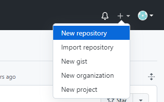
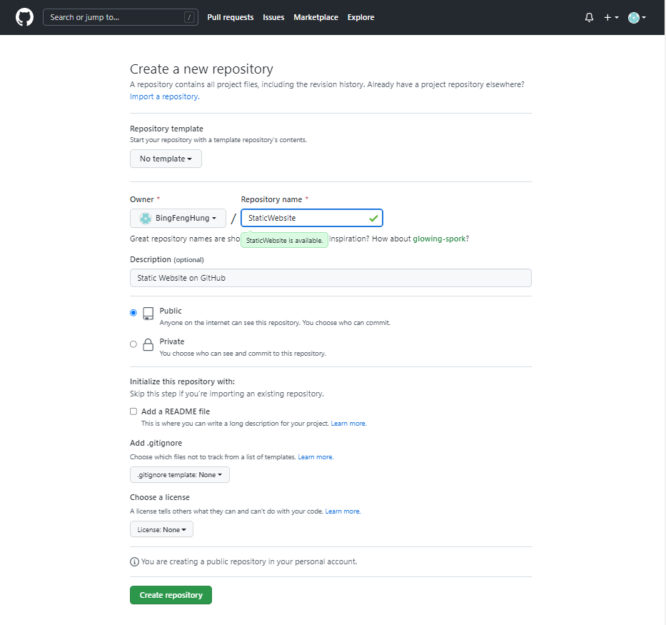
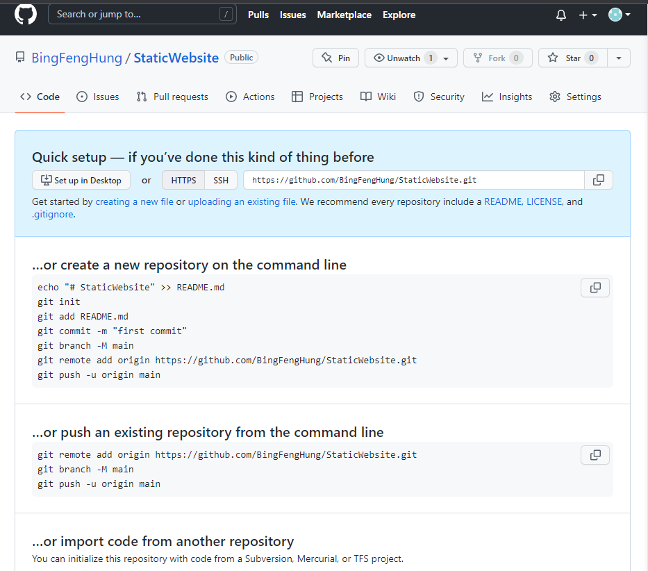
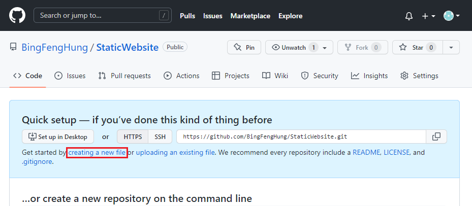
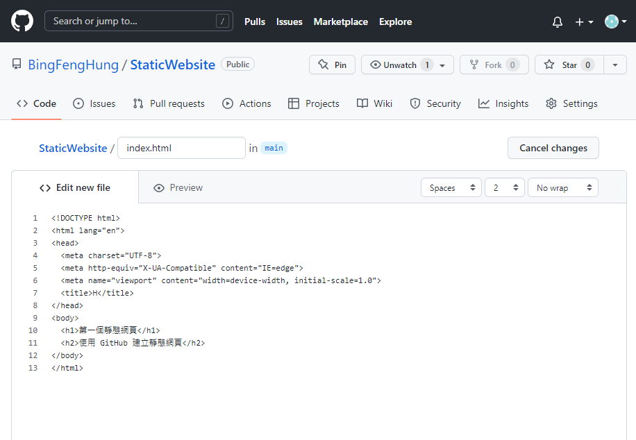
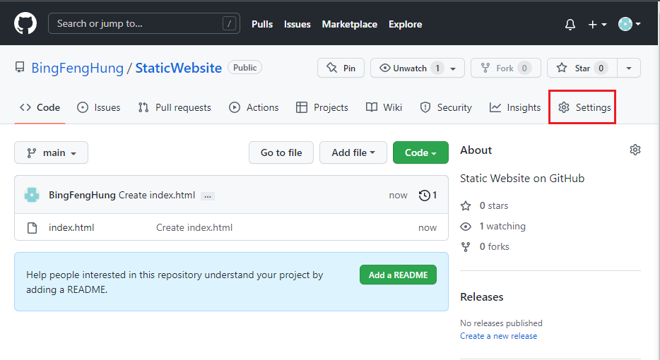
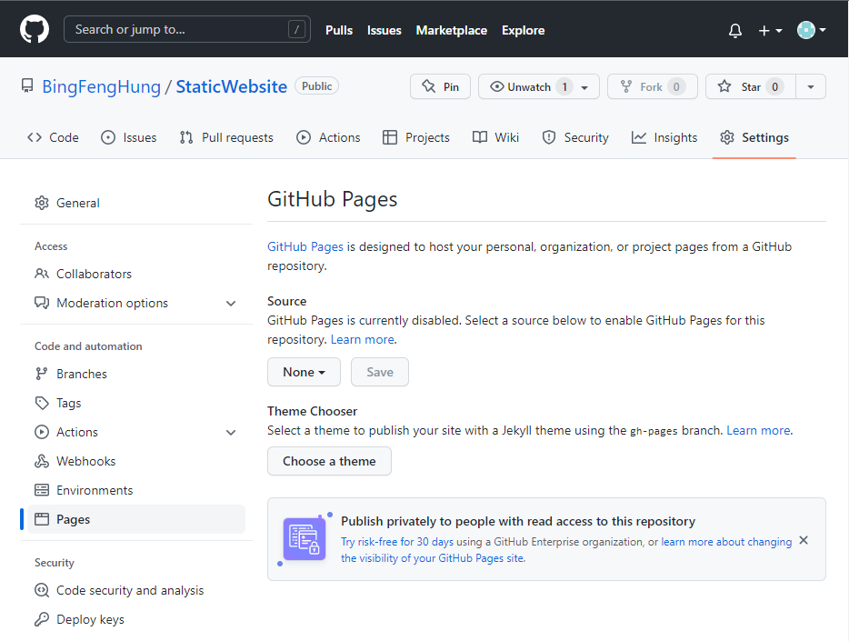
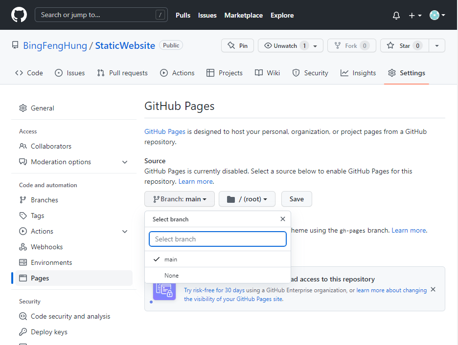
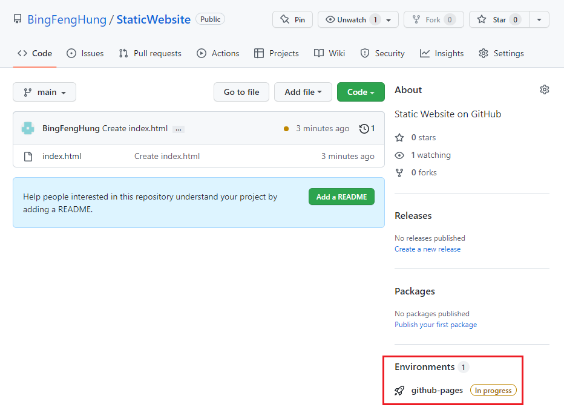
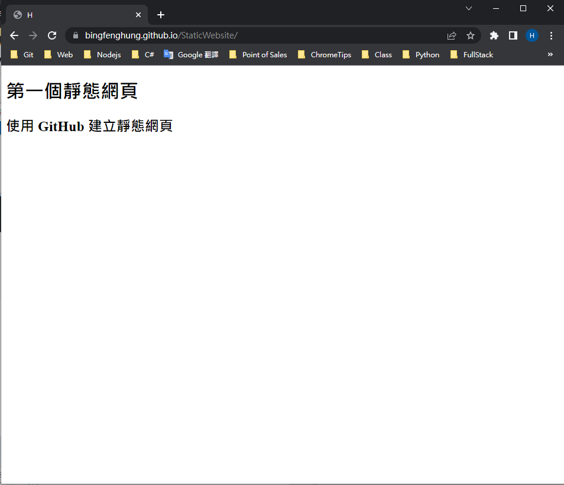

# GitHub 靜態網站建立

透過 GitHub 就可以有一個免費的空間放置靜態網站，其做法如下，
1. 先建立一個 GitHub 帳號
2. 建立一個 GitHub Repository 專案
3. 在專案中新增一個 index.html 的靜態網頁
4. 到專案中的設定頁面
    - 左側編列表找到 Code and automation 群組 
    - 點選 Pages 在 Source 的地方選擇想要變成靜態網站的分支
5. 瀏覽網頁 http://"GitHub 帳號名稱".github.io/"專案名稱"

## 1. 建立一個 GitHub 帳號
如果有帳號就直接登入沒有就到 GitHub 官網進行註冊 [GitHub](https://github.com/)

## 2. 建立一個 GitHub Repository 專案
登入 GitHub 帳號之後，點選右上角有一個 + 的符號，選擇 New repository 建立一個新專案

點擊進去之後，輸入專案的名稱，並且記得要選 Public 才可以，其他資訊可依個人需求填寫，完成之後，按下最下面的 Create repository 按鈕，就完成專案的建立了。

## 3. 在專案中新增一個 index.html 靜態網頁
專案完成建立之後，可看到以下畫面，表示有建立成功

在藍色區塊中找到 creating a new file 建立一個新的檔案

上面輸入框的部分輸入 index.html ，下面編輯區就是加入網頁內容

完成之後，在下面輸入一些提交訊息，就可以按下 Commit new file 了

## 4. 到專案中的設定頁面
接著點選專案中的 Settings 標籤

看到左側邊的 Code and automation 找到 Pages 標籤

選擇要做為靜態網站的分支，這邊選擇 main 作為分支，選擇完畢之後，按下 Save

## 5. 瀏覽網頁 http://"GitHub 帳號名稱".github.io/"專案名稱"
可以看到專案的右下角有一個 Environment，會顯示目前的狀態，像是目前 In progress，正在部屬中

當 github-pages 的狀態是 Active 時，就可以使用 http://BingFengHung.github.io/StaticWebsite 查看剛剛的網頁了

20220618
